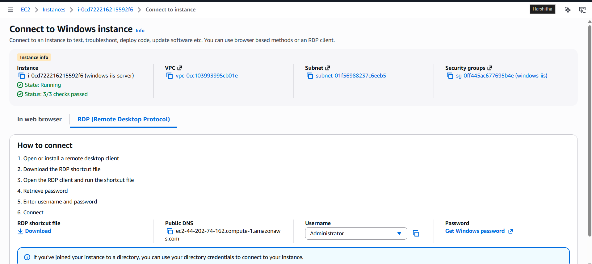
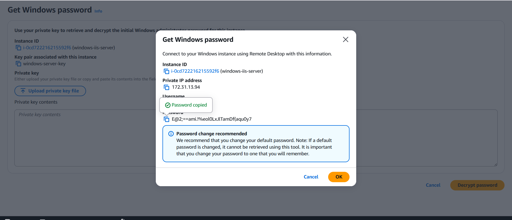
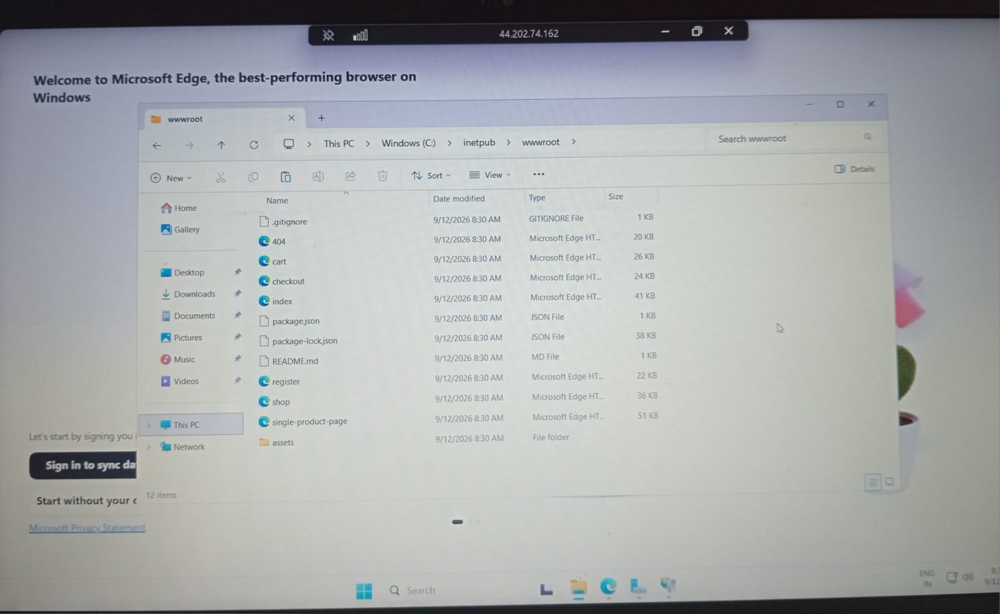

# Windows IIS Server

## 🌐 Website Deployment using Amazon EC2 and IIS

This project is a website that was deployed and hosted on a **Windows Server EC2 instance** using **Internet Information Services (IIS)**.

## 🛠️ Technologies Used

- HTML
- CSS
- JavaScript
- Amazon EC2
- Windows Server
- IIS (Internet Information Services)
- Git & GitHub

## ☁️ Deployment using Amazon EC2 and IIS

The website was deployed on a Windows EC2 instance and hosted using IIS.

### Deployment Steps

1. Created a Windows Server EC2 instance.
2. Connected to the Windows EC2 instance using Remote Desktop Protocol (RDP).
3. Installed **IIS (Internet Information Services)** using Server Manager.
4. Placed the website files inside the IIS `wwwroot` directory.
5. Configured IIS to host the website.
6. Configured the required AWS security group settings.
7. Accessed the deployed website using the EC2 instance's public IP address.

## 📸 Deployment Screenshots

### 1. Windows EC2 Instance

The screenshot below shows the Windows EC2 instance created for hosting the website.

### 2. Windows EC2 Password Decryption

The screenshot below shows the process of retrieving the initial Windows Administrator password for the EC2 instance using the associated private key.

### 3. Website Files in wwwroot

The screenshot below shows the website files placed inside the IIS `wwwroot` directory.

### 4. Website Hosted on IIS

The screenshot below shows the TailStore website successfully hosted using IIS on the Windows EC2 server.

## 🚀 Hosting

**Hosting Platform:** Amazon EC2  
**Operating System:** Windows Server  
**Web Server:** IIS  
**Version Control:** GitHub
